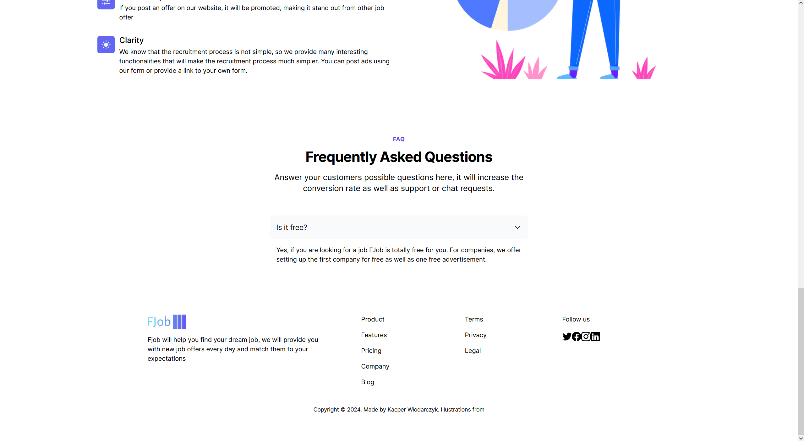

<a name="readme-top"></a>

[![Contributors][contributors-shield]][contributors-url]
[![Forks][forks-shield]][forks-url]
[![Stargazers][stars-shield]][stars-url]
[![Issues][issues-shield]][issues-url]
[![MIT License][license-shield]][license-url]
[![LinkedIn][linkedin-shield]][linkedin-url]


<br />
<div align="center">
  <h3 align="center">Fjob backend</h3>

  <p align="center">
    FJob is a fullstack application (main technologies: Django Rest Framework, Nextjs, Selenium). FJob, by collecting job offers from many job portals (currently only JustJoinIT, but there are already scripts ready to collect data from: olx, Pracujpl, nofluffjobs, Pracujpl) and enabling companies to post their own job offers will allow you to easily search for job offers.
    <br />
    <br />
    <a href="https://github.com/DEENUU1/fjob_frontend/issues">Report Bug</a>
    ·
    <a href="https://github.com/DEENUU1/fjob_frontend/issues">Request Feature</a>
  </p>
</div>

## System Architecture

Fjob consists of 3 repositories:

- Backend https://github.com/DEENUU1/fjob_backend
- Frontend (current)
- Scrapers https://github.com/DEENUU1/fjob_scrapers


## Features

1. <strong>JWT and OAuth Google</strong> Integration:
    - Utilizes JSON Web Tokens (JWT) in conjunction with OAuth Google for secure authentication and authorization processes.
2. <strong>Web Scraping</strong> and API-driven Database Storage:
    - Implements web scraping techniques to extract job offers from various websites.
    - Processes and transmits the gathered data via API for storage in the database.
3. Error Reporting and Favorites Functionality:
    - Incorporates a robust error reporting mechanism.
    - Enables users to save job offers to favorites for convenient retrieval.
4. <strong>Advanced Filtering, Sorting, Pagination, and Search Capabilities</strong>:
    - Provides sophisticated filtering, sorting, and pagination options for efficient data exploration.
    - Facilitates advanced job search functionalities.
5. <strong>Stripe Integration</strong> for Business Listings Purchase:
    - Integrates with Stripe payment gateway, allowing businesses to purchase listings seamlessly.
6. User and Company Account Management:
    - Enables the creation of both regular user accounts and company accounts.
7. <strong>Django Signals</strong> for Automated Services:
    - Utilizes Django Signals for the automation of various services, including updating available job offers, sending email
      notifications post-payment, and handling errors in job offers.
    - Instantiates Company objects following the creation of a company account.
8. <strong>Custom Commands and Permissions</strong>:
    - Implements custom commands and permissions for enhanced control and flexibility.
9. Default Data Upload and Localization:
    - Includes functionality for uploading default countries, cities, and regions (currently focused on Poland).
10. <strong>NextJS</strong> and Typescript for Frontend:
    - Develops the frontend application using NextJS and Typescript for a robust and type-safe user interface.
11. <strong>CI/CD</strong> with GitHub Actions:
    - Implements Continuous Integration/Continuous Deployment (CI/CD) using GitHub actions.
    - Automates unit tests and deploys the latest code version to an AWS EC2 instance.
12. <strong>NGINX</strong> Configuration for <strong>Network Traffic Handling</strong>:
    - Utilizes NGINX on the EC2 instance to efficiently manage network traffic.
13. SSL Certificate Renewal with <strong>Certbot</strong>:
    - Configures Certbot for automatic SSL certificate renewal, ensuring secure communication.
14. Background Task Handling with <strong>Redis and Celery</strong>:
    - Incorporates Redis and Celery for background task processing.
15. <strong>AWS Integration for Scalability and Reliability:</strong>
    - Integrates Django Rest Framework with AWS S3 Bucket for storing static files and model data.
    - Utilizes Google Cloud SQL for a reliable and secure database.
    - Leverages AWS services such as CodeBuild for web scraping functions on Lambda, ElasticIP Addresses for fixed IP
      assignment, Route 53 for domain management, and Amplify for hosting and deployment.
16. <strong>Event-Driven Architecture</strong> with <strong>AWS EventBridge</strong>:
    - Implements AWS EventBridge to automatically trigger each web scraping function.
17. Sentry Integration for Error Monitoring:
    - Integrates with the Sentry platform to monitor and analyze errors in the system.


## Technologies:

#### Backend

- Python
    - Django
    - Django Rest Framework
    - Celery
    - Docker
    - Docker Compose
    - Pytest
- Redis
- CI/CD
- AWS EC2
- AWS S3 Bucket
- AWS Elastic IP
- AWS Route 53
- Certbot
- NGINX
- Google Cloud SQL (postgre)
- SQLite
- Stripe


#### Frontend

- Nextjs
- Typescript
- AWS Amplify





#### Scrapers

- Python
    - Selenium
    - Requests
    - Beautiful Soup 4
- AWS Lambda
- AWS EventBridge
- AWS CodeBuild

## Backend locally

Backend in local mode use SQLite so there is no need to use Docker/Docker-compose

#### Installation

```bash
# Clone repository
git clone <url>

# Create .env file 
cp .env_example .env

# Install libraries
pip install -r requirements.txt

# Apply migrations
python manage.py migrate 

# Create super user 
python manage.py createsuperuser (in User Type type "USER")

# Run server 
python manage.py runserver 
```

#### Commands

Run pytest

```bash
pytest 
```

Create default Product objects

```bash
python manage.py products
```

Upload default cities and regions for Poland

```bash
python manage.py poland 
```

## Frontend locally

#### Installation

```bash
# Clone repository
git clone <url>

# Install npm packages
npm install 

# Create .env file in root directory `env.local`
NEXT_PUBLIC_HOST=http://localhost:8000
API_URL=http://localhost:8000/
WORK_MODE=dev

# Run developer mode
npm run dev 
```

## Scrapers locally

#### Installation

```bash
# Clone repository
git clone <url>

# Install libraries
pip install -r requirements

# Create .env file 
cp .env_example .env
```

## Authors

- [@DEENUU1](https://www.github.com/DEENUU1)

<!-- LICENSE -->

## License

See `LICENSE.txt` for more information.


<!-- MARKDOWN LINKS & IMAGES -->
<!-- https://www.markdownguide.org/basic-syntax/#reference-style-links -->

[contributors-shield]: https://img.shields.io/github/contributors/DEENUU1/fjob_frontend.svg?style=for-the-badge

[contributors-url]: https://github.com/DEENUU1/fjob_frontend/graphs/contributors

[forks-shield]: https://img.shields.io/github/forks/DEENUU1/fjob_frontend.svg?style=for-the-badge

[forks-url]: https://github.com/DEENUU1/fjob_frontend/network/members

[stars-shield]: https://img.shields.io/github/stars/DEENUU1/fjob_frontend.svg?style=for-the-badge

[stars-url]: https://github.com/DEENUU1/fjob_frontend/stargazers

[issues-shield]: https://img.shields.io/github/issues/DEENUU1/fjob_frontend.svg?style=for-the-badge

[issues-url]: https://github.com/DEENUU1/fjob_frontend/issues

[license-shield]: https://img.shields.io/github/license/DEENUU1/fjob_frontend.svg?style=for-the-badge

[license-url]: https://github.com/DEENUU1/fjob_frontend/blob/master/LICENSE.txt

[linkedin-shield]: https://img.shields.io/badge/-LinkedIn-black.svg?style=for-the-badge&logo=linkedin&colorB=555

[linkedin-url]: https://linkedin.com/in/kacper-wlodarczyk

[basic]: https://github.com/DEENUU1/fjob_frontend/blob/main/assets/v1_2/basic.gif?raw=true

[full]: https://github.com/DEENUU1/fjob_frontend/blob/main/assets/v1_2/full.gif?raw=true

[search]: https://github.com/DEENUU1/fjob_frontend/blob/main/assets/v1_2/search.gif?raw=true
